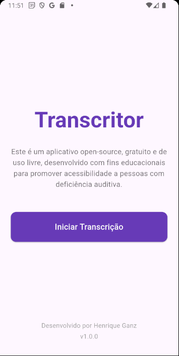
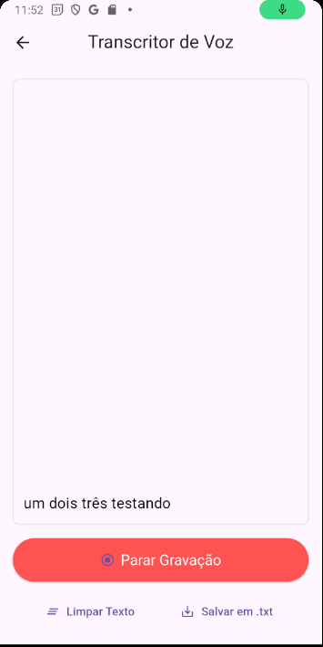

# 🎙️ Transcritor de Voz em Flutter

Aplicativo open source, gratuito e de cunho educativo, desenvolvido com o objetivo de promover acessibilidade para pessoas com deficiência auditiva. Criado utilizando Flutter e Dart, o app realiza transcrição de voz em tempo real diretamente no dispositivo.

> __ > __

---

## 🚀 Sobre o Projeto

O **Transcritor de Voz** é uma ferramenta leve e eficiente para conversão de voz em texto em tempo real. Além de ser um recurso valioso de acessibilidade, o projeto também serve como exemplo prático para desenvolvedores Flutter que desejam trabalhar com APIs nativas de reconhecimento de voz.

---

## ✨ Funcionalidades

- 🎤 **Transcrição Instantânea**: converte automaticamente o áudio captado pelo microfone em texto.
- 🌍 **Seletor de Idiomas**: suporte a 6 idiomas (Português BR, Inglês US, Espanhol, Francês, Alemão e Italiano) com troca em tempo real.
- 📋 **Copiar para Área de Transferência**: copie rapidamente o texto transcrito com um único toque.
- 📚 **Histórico de Transcrições**: salva automaticamente as últimas 20 transcrições com data/hora para consulta posterior.
- 🔤 **Ajuste de Tamanho da Fonte**: personalize o tamanho do texto (12-32pt) para melhor legibilidade e acessibilidade.
- 🌓 **Modo Escuro/Claro**: alterne entre temas claro e escuro para conforto visual em diferentes ambientes.
- 🟢 **Botão de Ação Única**: interface simples para iniciar ou parar a transcrição com um único toque.
- 🧹 **Gerenciamento de Texto**: permite limpar a transcrição ou salvá-la localmente.
- 📁 **Exportar e Compartilhar**: possibilita salvar a transcrição em um arquivo `.txt` e compartilhá-lo via recursos nativos do sistema.

---

## 🛠️ Tecnologias e Dependências

- **Framework:** Flutter `3.x.x` (canal estável)
- **Linguagem:** Dart `3.x.x`
- **JDK:** versão 17
- **IDE Recomendadas:** Android Studio 2023+ ou Visual Studio Code com extensão Flutter
- **Android SDK:** API Nível 34 (ou superior)

### 📦 Principais pacotes utilizados

| Pacote                | Descrição                                       |
| --------------------- | ----------------------------------------------- |
| `speech_to_text`      | Reconhecimento de voz nativo                    |
| `path_provider`       | Localização segura de diretórios no dispositivo |
| `share_plus`          | Compartilhamento de arquivos via sistema nativo |
| `shared_preferences`  | Persistência de preferências do usuário         |

---

### ⚙️ Como Rodar o Projeto

## Pré-requisitos

Certifique-se de ter o [Flutter SDK](https://docs.flutter.dev/get-started/install) instalado e o ambiente configurado corretamente. Execute:

```bash
flutter doctor
```

## 1. Clonando para sua máquina

Clone o repositório do projeto usando Git:

```bash
    git clone <URL_DO_SEU_REPOSITÓRIO_GIT>
    cd transcritor_flutter_app
```

## 2. Instalando as dependências

O flutter irá se encarregar disso, basta rodar:

```bash
    flutter pub get
```

## 3. Configurar Permissões (Android)

O app requer permissões de microfone e internet. Edite o arquivo <android/app/src/main/AndroidManifest.xml> e adicione o seguinte dentro da tag <manifest> e fora da tag <application>:

```bash
    <uses-permission android:name="android.permission.RECORD_AUDIO"/>
    <uses-permission android:name="android.permission.INTERNET"/>
```

## 4. Hora de rodar!

Apenas rode no seu terminal:

```bash
    flutter run
```

## Gerando um APK para Testes

Se quiser gerar um .apk instalável para testes em outros dispositivos Android, utilize:

```bash
    flutter build apk --debug
```

## Desenvolvido por Henrique Ganz

## Versão: v1.0.0
